# GrADyS, Gym, and RL Closed-Loop Guide

本文档说明 `showcases/rl-bridge` 里 GrADyS 仿真、Gymnasium 接口和
强化学习循环是如何闭环的，并给出记录状态、动作、奖励、轨迹等 RL 数据的
方法。

## 1. 一句话理解

这个项目把系统分成三层：

```text
GrADyS-SIM
  负责离散事件仿真、节点位置、UAV 速度控制、计时器和移动性演化

GradysUAVServiceCoreEnv
  负责把仿真世界封装成 RL 语义: reset(), step(), observation, action, reward

Gymnasium / PettingZoo / RLlib adapters
  负责把同一个核心环境转换成不同 RL 库需要的 API 形状
```

也就是说，GrADyS 不直接知道什么是 PPO、MAPPO、回报函数或 replay buffer。
RL 算法也不直接操纵 GrADyS 的底层事件队列。中间的
`GradysUAVServiceCoreEnv` 是桥。

## 2. 文件地图

| 文件 | 作用 |
| --- | --- |
| `gradys_uav_service_env.py` | 核心环境。这里定义任务、配置、观测、动作解释、奖励和 `reset/step` 闭环。 |
| `rl_protocols.py` | GrADyS 节点协议。UAV 协议接受外部速度命令，edge device 是被动节点。 |
| `gymnasium_adapter.py` | Gymnasium 单控制器封装。把多 UAV 字典观测压平成一个向量。 |
| `pettingzoo_parallel_adapter.py` | PettingZoo ParallelEnv 封装，适合多智能体 RL。 |
| `rllib_multiagent_adapter.py` | RLlib MultiAgentEnv 封装。 |
| `baseline_policies.py` | 规则策略，例如 random、nearest、EDF、SLO-risk。 |
| `experiment_runner.py` | 多 episode 评测、汇总、写 CSV。 |
| `main_random.py` | 不依赖 Gym 的核心环境 smoke test。 |
| `main_baselines.py` | 规则 baseline 批量评测入口。 |
| `main_gym_random.py` | Gymnasium wrapper smoke test。 |
| `main_visualize.py` | 记录一条 episode 轨迹并导出 PNG/GIF。 |
| `outputs/` | 约定的 rl-bridge 输出目录，所有探索产物放这里。 |

## 3. 整体数据流

```mermaid
flowchart LR
    A["RL policy / baseline"] -->|"actions"| B["GradysUAVServiceCoreEnv.step"]
    B --> C["decode task choices"]
    C --> D["RLControlledUAVProtocol.set_velocity"]
    D --> E["GrADyS DynamicVelocityMobilityHandler"]
    E --> F["step_simulation until control interval"]
    F --> G["node positions and telemetry update"]
    G --> H["task completion / timeout / energy accounting"]
    H --> I["observations, rewards, done, infos"]
    I --> A
```



闭环核心是：

```text
s_t = 当前观测
a_t = 策略选择的动作
GrADyS 仿真推进一个控制周期
r_t = 任务完成、超时、等待、移动代价组成的奖励
s_{t+1} = 推进后的新观测
```

## 4. GrADyS 层做了什么

GrADyS 层对应真实仿真世界，主要在 `reset()` 里构建：

```python
builder = SimulationBuilder(
    SimulationConfiguration(
        duration=config.episode_duration,
        real_time=False,
        execution_logging=False,
    )
)
builder.add_handler(TimerHandler())
builder.add_handler(DynamicVelocityMobilityHandler(mobility_config))
```

其中：

- `SimulationBuilder` 创建一次 episode 的仿真对象。
- `TimerHandler` 提供计时器事件。
- `DynamicVelocityMobilityHandler` 根据速度命令更新 UAV 位置。
- `RLControlledUAVProtocol` 是 UAV 节点协议，外部 RL 环境通过
  `set_velocity()` 给它下发速度。
- `PassiveEdgeDeviceProtocol` 是 edge device 节点，只提供空间位置。

UAV 节点创建方式：

```python
node_id = builder.add_node(
    RLControlledUAVProtocol,
    (center, center, config.altitude),
)
```

edge device 节点创建方式：

```python
builder.add_node(PassiveEdgeDeviceProtocol, (x_pos, y_pos, 0.0))
```

因此，GrADyS 负责的是：

- 节点在哪里；
- UAV 速度命令如何变成位置变化；
- 仿真时间如何推进；
- telemetry 如何反馈给协议。

RL 层不直接修改节点坐标，而是给 UAV 发速度命令，让 GrADyS 自己推进。

## 5. 核心环境 reset() 的流程

`GradysUAVServiceCoreEnv.reset()` 做了这些事：

1. 设置随机种子。
2. 清空上一个 episode 的任务、目标、能耗、奖励和统计计数。
3. 随机生成 edge device 的二维位置。
4. 配置动态速度移动模型。
5. 创建 GrADyS 仿真 builder。
6. 添加 timer handler 和 mobility handler。
7. 添加 UAV 节点和 edge device 节点。
8. `builder.build()` 生成仿真对象。
9. `_prime_simulation()` 推进一次，让 handler 和 protocol 初始化。
10. `_generate_tasks()` 生成初始任务。
11. 返回每个 UAV 的初始观测。

返回值形状是多智能体字典：

```python
{
    "uav_0": [...],
    "uav_1": [...],
    ...
}
```

这就是 RL 里的初始 `s_0`。

## 6. 核心环境 step() 的流程

`step(actions)` 是闭环最关键的函数。输入是每个 UAV 的动作：

```python
{
    "uav_0": 1,
    "uav_1": 0,
    "uav_2": 3,
}
```

一次 `step()` 内部做这些事：

```text
1. 按当前 pending task 数量给等待惩罚
2. 删除已经超过 deadline 的任务，并记录 miss
3. 把动作解码成 UAV 的服务目标
4. 根据目标任务位置给 UAV 下发速度命令
5. 调用 GrADyS step_simulation() 推进仿真时间
6. 检查 UAV 是否到达任务服务半径
7. 对成功任务给 success reward，对超时完成给 miss penalty
8. 生成新到达任务
9. 按移动距离加入 movement penalty，并累计能耗
10. 返回新观测、奖励、终止标志和 info
```

代码结构大致是：

```python
rewards = wait_penalty * pending_tasks
_expire_tasks(rewards)
_assign_new_targets(actions)
_command_uav_velocities()
_advance_until(time_before + control_interval)
_update_target_arrivals(rewards)
_generate_tasks()
add_movement_penalty(rewards)
return StepResult(observations, rewards, terminated, truncated, infos)
```

需要注意：GrADyS 是事件驱动仿真，不是固定步长数组仿真。`control_interval`
表示 RL 希望推进的控制周期，但底层事件可能让实际时间略微跨过目标时间。
例如你运行 smoke test 时会看到 `t=1.2s`，这是移动性更新事件粒度造成的。

## 7. 状态 observation 怎么定义

每个 UAV 的观测长度是：

```text
5 + 7 * candidate_limit
```

默认 `candidate_limit=5` 时，每个 UAV 的 observation size 是 `40`。

前 5 维是 UAV 自身和系统概况：

| 维度 | 含义 |
| --- | --- |
| `x / area_size` | UAV 当前 x 坐标归一化 |
| `y / area_size` | UAV 当前 y 坐标归一化 |
| `energy_used / 1000` | 简化能耗累计 |
| `busy_remaining / episode_duration` | UAV 正在计算服务时的剩余忙碌时间 |
| `pending_tasks / num_devices` | 当前任务队列压力 |

后面每个候选任务占 7 维：

| 维度 | 含义 |
| --- | --- |
| `(task_x - uav_x) / area_size` | 相对 x 偏移 |
| `(task_y - uav_y) / area_size` | 相对 y 偏移 |
| `distance / area_size` | UAV 到任务位置的归一化距离 |
| `(deadline - now) / episode_duration` | 剩余 deadline slack |
| `(deadline - now - travel_time - service_time) / episode_duration` | 估计服务完成 slack |
| `compute_demand / compute_scale` | 计算需求归一化 |
| `data_size / data_scale` | 数据量归一化 |

候选任务由 `candidate_tasks(agent)` 给出，当前实现按：

```text
deadline 越近越靠前；
deadline 相同时，距离 UAV 越近越靠前。
```

如果候选任务不足 `candidate_limit`，后面用 0 补齐，保证观测维度固定。

## 8. 动作 action 怎么定义

核心环境里的每个 UAV 是一个离散动作：

```text
0      -> hover，不选择新任务
1..K   -> 选择候选任务列表中的第 1..K 个任务
```

这里 `K = candidate_limit`，所以：

```python
env.action_size == candidate_limit + 1
```

动作不是直接的速度向量。动作先选择服务哪个任务，然后环境根据 UAV 位置和任务位置
自动计算速度：

```python
velocity = _velocity_toward(agent, task.location)
protocol.set_velocity(velocity)
```

这种设计的好处是先把 RL 问题简化成“调度/分派任务”，把低层移动控制交给
GrADyS 的 mobility handler。后续如果要研究连续控制，可以再把动作扩展成
速度、加速度、航向角或资源分配联合动作。

## 9. 奖励 reward 怎么定义

当前奖励由四部分组成。

### 9.1 等待惩罚

每一步按 pending task 数量惩罚：

```python
wait_penalty * len(self._tasks)
```

这会促使策略减少任务积压。

### 9.2 成功服务奖励

UAV 到达任务服务半径，并且计算完成时间不晚于 deadline：

```python
success_reward
```

默认是 `+10.0`。

### 9.3 超时惩罚

任务超过 deadline，或服务完成时间晚于 deadline：

```python
miss_penalty
```

默认是 `-10.0`。

### 9.4 移动惩罚

每一步按 UAV 近似移动距离扣分：

```python
movement_penalty * distance_moved
```

默认 `movement_penalty=-0.01`。这相当于一个简化能耗项。

核心环境返回的是 per-agent reward：

```python
{
    "uav_0": -0.24,
    "uav_1": 9.76,
    ...
}
```

Gymnasium wrapper 里会把所有 UAV 的 reward 求和，变成一个 centralized scalar reward。

## 10. done 和 info

episode 结束条件很简单：

```python
terminated = env.time >= episode_duration
truncated = False
```

`infos` 是 per-agent 字典，包含：

```python
{
    "time": 当前仿真时间,
    "pending_tasks": 当前待处理任务数,
    "hits": 成功任务数,
    "misses": 超时或失败任务数,
    "energy_used": 当前 UAV 能耗,
}
```

除此之外，环境还提供：

```python
env.metrics_snapshot()
```

用于 episode 级统计，例如 success rate、miss rate、总能耗、生成任务数等。

还提供：

```python
env.visualization_snapshot()
```

用于可视化和轨迹记录，包括 UAV 位置、edge device 位置、pending tasks、
当前 target 分派等。

## 11. Gymnasium 是怎么接上的

`GradysUAVServiceGymEnv` 是一个 centralized controller 视角。

核心环境本来是字典：

```python
observations = {
    "uav_0": obs0,
    "uav_1": obs1,
}
actions = {
    "uav_0": action0,
    "uav_1": action1,
}
```

Gymnasium 需要标准 `Env` 接口，所以 wrapper 做了三件事。

### 11.1 observation_space

把所有 UAV 的观测拼接成一个大向量：

```python
obs_size = core.observation_size * len(core.agents)
observation_space = spaces.Box(
    low=-inf,
    high=inf,
    shape=(obs_size,),
    dtype=np.float32,
)
```

例如 `num_uavs=1, candidate_limit=3` 时：

```text
observation_size = 5 + 7 * 3 = 26
obs_shape = (26,)
```

### 11.2 action_space

给每个 UAV 一个离散动作，然后拼成 `MultiDiscrete`：

```python
action_space = spaces.MultiDiscrete(
    [core.action_size] * len(core.agents)
)
```

例如 `num_uavs=1, candidate_limit=3` 时：

```text
action_space = MultiDiscrete([4])
```

### 11.3 step(action)

Gym action 是数组，wrapper 把它转换回核心环境需要的字典：

```python
action_dict = {
    agent: int(action[index])
    for index, agent in enumerate(core.agents)
}
result = core.step(action_dict)
```

然后：

```python
observation = flatten(result.observations)
reward = sum(result.rewards.values())
terminated = result.terminated
truncated = result.truncated
info = {"agent_infos": result.infos}
```

所以，Gym 闭环是：

```python
obs, info = env.reset(seed=3)
done = False

while not done:
    action = env.action_space.sample()
    next_obs, reward, terminated, truncated, info = env.step(action)
    done = terminated or truncated
    obs = next_obs
```

这就是标准 RL 训练库需要的接口。

## 12. PettingZoo 和 RLlib 的差别

Gymnasium wrapper 是 centralized single-agent 视角，适合先跑 PPO 或 smoke test。

如果要做多智能体：

- `pettingzoo_parallel_adapter.py` 保持 per-agent observation、action、reward 字典。
- `rllib_multiagent_adapter.py` 返回 RLlib 需要的 `terminateds["__all__"]` 和
  `truncateds["__all__"]`。

PettingZoo/RLlib 的每个 UAV 都可以被看成一个 agent：

```python
observations["uav_0"] -> uav_0 的局部观测
actions["uav_0"]      -> uav_0 的任务选择动作
rewards["uav_0"]      -> uav_0 的局部奖励
```

这更适合 MAPPO、IPPO、QMIX 等 multi-agent 训练。

## 13. 如何记录 RL 过程数据

记录 RL 数据时，最重要的是明确你要记录哪种粒度。

### 13.1 episode summary 粒度

如果只关心每个 episode 的总体结果，直接用：

```bash
python showcases/rl-bridge/main_baselines.py \
  --episodes 5 \
  --csv-output showcases/rl-bridge/outputs/baselines.csv
```

这会记录：

- policy
- episode
- seed
- steps
- total_reward
- generated_tasks
- hits
- misses
- pending_tasks
- success_rate
- miss_rate
- total_energy_used
- mean_pending_tasks
- max_pending_tasks

对应实现是 `experiment_runner.py` 里的：

```python
write_episode_csv(path, rows)
```

### 13.2 transition 粒度

如果要训练或分析 RL，通常要记录每一步 transition：

```text
(s_t, a_t, r_t, s_{t+1}, done, info)
```

核心环境里可以这样理解：

```python
observations = env.reset(seed=seed)

while not done:
    state_t = observations
    actions = policy(env, rng)
    result = env.step(actions)

    transition = {
        "state": state_t,
        "action": actions,
        "reward": result.rewards,
        "next_state": result.observations,
        "terminated": result.terminated,
        "truncated": result.truncated,
        "info": result.infos,
    }

    observations = result.observations
```

对于单个 UAV：

```python
agent = "uav_0"
single_agent_transition = {
    "s_t": state_t[agent],
    "a_t": actions[agent],
    "r_t": result.rewards[agent],
    "s_next": result.observations[agent],
    "done": result.terminated or result.truncated,
    "info": result.infos[agent],
}
```

对于 centralized Gym/PPO：

```python
centralized_transition = {
    "s_t": flatten_agent_dict(state_t, env.agents),
    "a_t": [actions[agent] for agent in env.agents],
    "r_t": sum(result.rewards.values()),
    "s_next": flatten_agent_dict(result.observations, env.agents),
    "done": result.terminated or result.truncated,
}
```

### 13.3 JSONL 详细记录模板

下面这个模板适合记录完整仿真过程。每一行是一个 step，方便后续用 pandas 读取。

```python
import json
import random
from dataclasses import asdict
from pathlib import Path

from baseline_policies import BASELINE_POLICIES
from gradys_uav_service_env import GradysUAVServiceCoreEnv, UAVServiceEnvConfig


def task_to_dict(task):
    return asdict(task)


def snapshot_to_dict(snapshot):
    return {
        "time": snapshot["time"],
        "agent_positions": snapshot["agent_positions"],
        "device_positions": snapshot["device_positions"],
        "pending_tasks": [
            task_to_dict(task)
            for task in snapshot["pending_tasks"]
        ],
        "targets": snapshot["targets"],
        "hits": snapshot["hits"],
        "misses": snapshot["misses"],
    }


config = UAVServiceEnvConfig(seed=7)
env = GradysUAVServiceCoreEnv(config)
policy = BASELINE_POLICIES["nearest"]
rng = random.Random(107)
output_path = Path("showcases/rl-bridge/outputs/trajectory_nearest.jsonl")
output_path.parent.mkdir(parents=True, exist_ok=True)

observations = env.reset(seed=7)
done = False
step = 0
total_reward = 0.0

with output_path.open("w") as file_obj:
    while not done:
        state_t = observations
        actions = policy(env, rng)
        result = env.step(actions)
        reward_sum = sum(result.rewards.values())
        total_reward += reward_sum
        done = result.terminated or result.truncated

        record = {
            "step": step,
            "time": env.time,
            "state": state_t,
            "action": actions,
            "reward": result.rewards,
            "reward_sum": reward_sum,
            "next_state": result.observations,
            "terminated": result.terminated,
            "truncated": result.truncated,
            "done": done,
            "info": result.infos,
            "metrics": env.metrics_snapshot(),
            "visualization": snapshot_to_dict(env.visualization_snapshot()),
            "total_reward": total_reward,
        }
        file_obj.write(json.dumps(record) + "\n")

        observations = result.observations
        step += 1

env.close()
```

之后可以这样读取：

```python
import pandas as pd

df = pd.read_json(
    "showcases/rl-bridge/outputs/trajectory_nearest.jsonl",
    lines=True,
)
print(df[["step", "time", "reward_sum", "done"]])
```

### 13.4 可视化记录

`main_visualize.py` 已经内置了一种轻量记录方式：

```python
snapshots.append(_snapshot(env, actions, total_reward))
```

每个 snapshot 包含：

- 当前时间；
- UAV 位置；
- edge device 位置；
- pending tasks；
- active targets；
- 当前动作；
- episode metrics；
- total reward。

默认运行：

```bash
python showcases/rl-bridge/main_visualize.py
```

输出：

```text
showcases/rl-bridge/outputs/nearest_episode.png
showcases/rl-bridge/outputs/nearest_episode.gif
```

## 14. 怎么把真实 RL 算法接进来

### 14.1 接 Gymnasium PPO

Gymnasium wrapper 已经满足标准训练库接口：

```python
from gymnasium_adapter import GradysUAVServiceGymEnv
from gradys_uav_service_env import UAVServiceEnvConfig

env = GradysUAVServiceGymEnv(
    UAVServiceEnvConfig(
        num_uavs=4,
        num_devices=30,
        episode_duration=60.0,
    )
)
```

训练库只需要反复调用：

```python
obs, info = env.reset()
action = model.predict(obs)
next_obs, reward, terminated, truncated, info = env.step(action)
```

因为 Gym wrapper 使用 centralized reward，适合先做单控制器 PPO baseline。

### 14.2 接 MAPPO/IPPO

如果要让每个 UAV 是一个智能体，使用 PettingZoo 或 RLlib wrapper 更自然。

PettingZoo 视角：

```python
from pettingzoo_parallel_adapter import parallel_env

env = parallel_env()
observations, infos = env.reset(seed=7)
actions = {
    agent: env.action_space(agent).sample()
    for agent in env.agents
}
observations, rewards, terminations, truncations, infos = env.step(actions)
```

这个接口直接暴露 per-agent 数据，适合 MAPPO/IPPO 的 rollout buffer。

### 14.3 接 RLlib PPO

当前仓库已经提供 RLlib 多智能体入口：

```bash
python showcases/rl-bridge/main_rllib_random.py
python showcases/rl-bridge/main_rllib_ppo_smoke.py --iterations 1 --quiet
```

`main_rllib_random.py` 直接实例化 `GradysUAVServiceRLlibEnv`，用随机动作检查
RLlib `MultiAgentEnv` 的基本数据形状，并写出：

```text
showcases/rl-bridge/outputs/rllib_random_rollout.jsonl
```

`main_rllib_ppo_smoke.py` 会注册环境：

```python
register_env(
    "gradys_uav_service_rllib",
    lambda config: GradysUAVServiceRLlibEnv(dict(config)),
)
```

然后使用一个 shared PPO policy：

```python
POLICY_ID = "shared_uav_policy"

config.multi_agent(
    policies={
        POLICY_ID: PolicySpec(
            observation_space=observation_space,
            action_space=action_space,
        )
    },
    policy_mapping_fn=lambda agent_id, *args, **kwargs: POLICY_ID,
)
```

这里的含义是：`uav_0`、`uav_1`、... 都是 RLlib multi-agent rollout 里的
独立 agent，但它们共享同一个策略网络参数。这是从规则策略过渡到 MAPPO/IPPO
前最稳的第一步。

当前 smoke test 为了便于本机调试，使用 legacy RLlib API stack：

```python
PPOConfig().api_stack(
    enable_env_runner_and_connector_v2=False,
    enable_rl_module_and_learner=False,
)
```

这不是最终形态，而是一个可跑的训练脚手架。后续可以再升级到 RLlib 新 API
stack、增加并行 EnvRunner、checkpoint、Tune 调参和集中式 critic。

一次成功的 PPO smoke test 会写出：

```text
showcases/rl-bridge/outputs/rllib_ppo_smoke_metrics.json
```

其中包含 Ray 版本、环境配置、PPO batch 参数和每次训练迭代的 reward/episode/step
统计。

### 14.4 PPO 训练与评价脚手架

`main_rllib_ppo_smoke.py` 只负责确认 RLlib 能点火。真正用于反复实验的是：

```bash
python showcases/rl-bridge/main_rllib_ppo_train.py \
  --iterations 10 \
  --eval-episodes 5 \
  --baseline-policies random,nearest,edf,slo-risk \
  --output-dir outputs/rllib_ppo_train
```

它做四件事：

1. 训练 shared-policy RLlib PPO。
2. 保存每个 training iteration 的 reward、episode 数和 sampled env steps。
3. 用训练后的 PPO policy 跑 deterministic evaluation episodes。
4. 在同一环境配置和 seed 组下跑规则 baseline，并输出对比表。

输出目录固定在 `showcases/rl-bridge` 内部。例如上面的命令会生成：

```text
showcases/rl-bridge/outputs/rllib_ppo_train/config.json
showcases/rl-bridge/outputs/rllib_ppo_train/training_metrics.csv
showcases/rl-bridge/outputs/rllib_ppo_train/training_metrics.json
showcases/rl-bridge/outputs/rllib_ppo_train/ppo_eval_episodes.csv
showcases/rl-bridge/outputs/rllib_ppo_train/baseline_eval_episodes.csv
showcases/rl-bridge/outputs/rllib_ppo_train/comparison_episodes.csv
showcases/rl-bridge/outputs/rllib_ppo_train/comparison_summary.csv
```

`comparison_summary.csv` 是评价 PPO 是否真的有用的第一张表。不要只看训练
reward，至少同时看：

```text
avg_reward
avg_success_rate
avg_miss_rate
avg_energy
avg_mean_pending
avg_max_pending
```

一个策略只有在同等任务负载下，比 `nearest`、`edf`、`slo-risk` 至少在
success/miss/energy 的综合表现上更好，才算真正学到了东西。

## 15. 从一次 step 看完整闭环

假设 `uav_0` 的候选任务列表是：

```text
candidate 1 -> task 12, deadline 最近
candidate 2 -> task 8
candidate 3 -> task 21
```

策略输出：

```python
actions = {"uav_0": 1}
```

核心环境发生：

1. `1` 被解释为选择候选任务 1，也就是 `task 12`。
2. `_targets["uav_0"] = 12`。
3. `_velocity_toward("uav_0", task_12.location)` 计算飞向任务点的速度。
4. `RLControlledUAVProtocol.set_velocity()` 把速度发送给 GrADyS mobility handler。
5. GrADyS 推进仿真时间，UAV 位置变化。
6. 如果 UAV 到达 `service_radius`，环境计算：

```text
completion_time = now + compute_demand / compute_rate
```

7. 若 `completion_time <= deadline`，`hits += 1`，给成功奖励。
8. 否则 `misses += 1`，给超时惩罚。
9. 生成 `s_{t+1}`，返回给策略。

这就是 GrADyS 和 RL 的完整一跳闭环。

## 16. 常见注意点

### 16.1 确保导入的是本仓库的 GrADyS

之前环境里有旧版 `gradysim 0.7.0`，而本 showcase 需要当前仓库版本。
推荐保持当前 editable 安装：

```bash
python -m pip install -e . --no-deps
```

这样 `import gradysim` 会指向当前仓库。

### 16.2 所有探索产物放在 rl-bridge 内

约定输出目录：

```text
showcases/rl-bridge/outputs/
```

例如：

```bash
python showcases/rl-bridge/main_baselines.py \
  --episodes 5 \
  --csv-output showcases/rl-bridge/outputs/baselines.csv
```

### 16.3 先跑规则策略，再接学习算法

推荐学习顺序：

1. `main_random.py` 理解核心环境闭环。
2. `main_baselines.py` 理解规则策略和 episode metrics。
3. `main_visualize.py` 看 UAV 轨迹、任务积压和 active assignments。
4. `main_gym_random.py` 理解 Gymnasium API 形状。
5. 接 Stable-Baselines3 PPO 或 PettingZoo/MAPPO。

### 16.4 奖励还只是 scaffold

当前奖励函数适合打通流程，但不一定是最终论文实验奖励。后续可以扩展：

- deadline slack shaping；
- AoI 或队列稳定性惩罚；
- UAV 能耗模型；
- 负载均衡；
- compute/offload/resource allocation；
- fairness 或 SLO violation risk。

## 17. 最小 mental model

你可以把整个项目记成下面这个循环：

```text
任务随机到达 edge devices
        |
每个 UAV 观察附近候选任务和自身状态
        |
策略选择 hover 或服务某个候选任务
        |
环境把任务选择转换成 UAV 速度命令
        |
GrADyS 推进 UAV 移动和仿真时间
        |
环境检查任务完成、超时、能耗和队列变化
        |
返回 next observation, reward, done, info
```

只要你能记录并理解每一步的：

```text
observation -> action -> reward -> next_observation
```

就已经抓住了 GrADyS、Gym 和 RL 闭环的主线。
