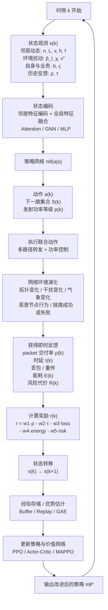

# DRL 路由状态-动作-奖励流程图

下面给出基于深度强化学习的安全感知多路径路由决策流程图，突出状态观测、动作输出、环境反馈与策略更新之间的闭环关系。

## 图注建议

图 X 展示了基于深度强化学习的安全感知多路径路由决策闭环流程。在每个时隙内，节点首先观测邻居动态、环境扰动、自身资源状态、业务类型以及历史反馈信息，并将其编码为当前状态输入策略网络。策略网络联合输出下一跳集合与发射功率等级，动作执行后由环境返回交付率、时延、丢包、能耗和风险等反馈信息，进一步构造即时奖励并驱动策略更新，从而形成“状态观测 - 动作决策 - 奖励反馈 - 策略优化”的闭环学习过程。
