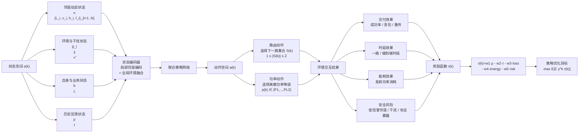

# DRL 路由状态-动作-奖励机制图

下面给出状态空间、动作空间和奖励函数的结构化机制图，更适合放在“问题建模”或“强化学习建模”小节中。

## 图注建议

图 Y 给出了基于深度强化学习的安全感知多路径路由机制。状态空间由邻居动态状态、环境与干扰状态、自身与业务状态以及历史反馈状态共同构成；动作空间由“下一跳集合选择”和“发射功率等级控制”两部分组成；奖励函数则综合考虑 packet 交付率、时延、丢包、能耗以及安全风险，实现对多目标路由性能的联合优化。该建模为后续采用 PPO、Actor-Critic 或 MAPPO 等深度强化学习算法求解最优策略提供了统一基础。
