# QMR 决策机制图（公式标注版）

这版突出 QMR 的关键变量、约束条件和 Q-learning 更新过程，更适合放在方法章节中解释模型公式。

```mermaid
flowchart LR
    A["输入
    当前节点 i
    目的节点 d
    邻居集合 N(i)
    数据包剩余时限"] --> B["剩余时限约束
    v_req = D(i,d) / T_deadline"]

    B --> C["对每个邻居 j 预测未来位置
    p_j(t3) = p_j(t1) + v_j (t3 - t1)"]
    C --> D["计算邻居推进能力
    v_act(i,j) = (D(i,d) - D(j_t3,d)) / delay_ij"]

    D --> E{"v_act(i,j) >= v_req ?"}
    E -->|是| F["进入候选集 C
    满足时延推进约束"]
    E -->|否| G["进入次级候选集
    作为退化备选"]

    F --> H["计算链路质量
    LQ_ij = d_f · d_r"]
    H --> I["计算距离权重
    m_ij = 1 - d_ij / R"]
    I --> J["综合权重
    k_ij = m_ij · LQ_ij"]
    J --> K["决策值
    Score_ij = k_ij · Q_ij"]
    K --> L["下一跳选择
    j* = argmax Score_ij"]

    L --> M["发送 DATA 给 j*"]
    M --> N["接收 ACK 反馈
    queuing delay / maxQ / local state"]
    N --> O["奖励函数
    到达目的节点: r = 10
    惩罚: r = -10
    否则: r = omega e^(-delay) + (1-omega) E_j/E_0"]
    O --> P["自适应学习率
    z = |d_cur - mu_d| / sigma_d
    alpha = max(0.3, 1 - e^(-z))"]
    P --> Q["Q-learning 更新
    Q_ij <- Q_ij + alpha (r + gamma maxQ - Q_ij)"]

    G --> R["若候选集为空
    选择 v_act 最大邻居
    或退化为 Q 最大邻居"]
    R --> M
```

## 配套说明

QMR 的核心思想是把“到达时限约束”和“强化学习路由更新”耦合起来。前半部分通过 `v_req` 与 `v_act` 的比较约束转发方向，避免选择无法满足剩余时限的邻居；后半部分通过 `LQ`、距离权重和 `Q` 值构造联合决策指标，从多个候选邻居中选出更优下一跳。数据成功转发后，节点再利用 `ACK` 中携带的延迟与局部状态信息，依据奖励函数和自适应学习率完成 Q 值更新，从而实现在线路由优化。

## 论文落地建议

- `qmr_flowchart_compact.md` 适合放在算法总览部分。
- `qmr_decision_diagram.md` 适合放在“路由决策模型”或“Q-learning 更新机制”小节。
- 如果版面紧张，可以正文放简洁版，公式标注版放附录或答辩 PPT。
