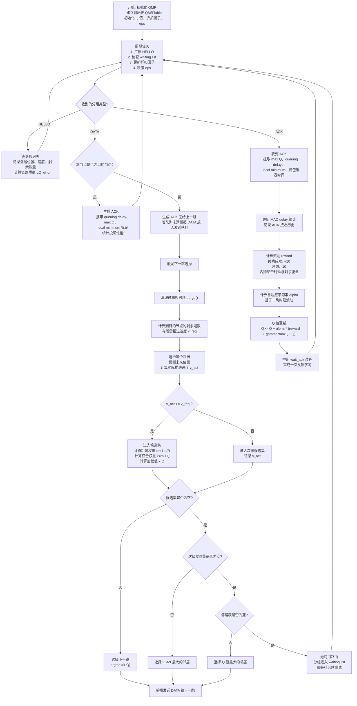

# QMR 算法流程图

下面的流程图基于当前项目中的 `QMR` 实现整理，覆盖了邻居发现、下一跳选择、ACK 反馈与 Q 值更新四个核心阶段。

## 可直接用于论文的简述

QMR 首先通过周期性 `HELLO` 交换维护邻居状态信息，并利用前向/反向投递比估计链路质量。对每个待发送数据包，节点根据剩余时限计算所需推进速度，再结合邻居的预测位置估计实际推进速度，从而筛出满足时延约束的候选邻居。在候选集中，QMR 使用“距离权重 × 链路质量 × Q 值”联合决策下一跳；若没有满足约束的候选邻居，则回退到次优选择策略。数据转发后，下一跳通过 `ACK` 反馈局部状态与学习信息，发送节点据此计算奖励、更新学习率并修正对应邻居的 `Q` 值，实现路由策略的在线自适应优化。
