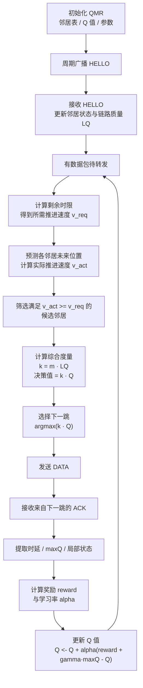

# QMR 简洁版流程图

这版更适合直接放在论文正文中，强调 QMR 的主流程，而不展开过多实现细节。

```mermaid
flowchart TD
    A["初始化 QMR
    邻居表 / Q 值 / 参数"] --> B["周期广播 HELLO"]
    B --> C["接收 HELLO
    更新邻居状态与链路质量 LQ"]
    C --> D["有数据包待转发"]
    D --> E["计算剩余时限
    得到所需推进速度 v_req"]
    E --> F["预测各邻居未来位置
    计算实际推进速度 v_act"]
    F --> G["筛选满足 v_act >= v_req 的候选邻居"]
    G --> H["计算综合度量
    k = m · LQ
    决策值 = k · Q"]
    H --> I["选择下一跳
    argmax(k · Q)"]
    I --> J["发送 DATA"]
    J --> K["接收来自下一跳的 ACK"]
    K --> L["提取时延 / maxQ / 局部状态"]
    L --> M["计算奖励 reward
    与学习率 alpha"]
    M --> N["更新 Q 值
    Q <- Q + alpha(reward + gamma·maxQ - Q)"]
    N --> D
```

## 图注建议

图 X 展示了 QMR 的紧凑型算法流程。协议首先通过 `HELLO` 分组维护邻居状态信息和链路质量，然后基于剩余时限约束与邻居未来位置预测筛选候选转发节点，最后结合链路质量和 Q 值完成下一跳选择，并利用 ACK 反馈持续更新路由学习状态。
