# SQMR 决策机制图（公式标注版）

```mermaid
flowchart LR
    A["输入
    当前节点 i
    目的节点 d
    邻居集合 N(i)
    剩余时限"] --> B["时限推进约束
    v_req = D(i,d) / T_deadline"]

    B --> C["预测邻居未来位置
    p_j(t3) = p_j(t1) + v_j (t3 - t1)"]
    C --> D["计算实际推进速度
    v_act(i,j) = (D(i,d) - D(j_t3,d)) / delay_ij"]

    D --> E{"v_act(i,j) >= v_req ?"}
    E -->|是| F["进入候选集 C"]
    E -->|否| G["进入次级候选集"]

    F --> H["计算链路质量
    LQ_ij = d_f · d_r"]
    H --> I["计算距离权重
    m_ij = 1 - d_ij / R"]
    I --> J["综合权重
    k_ij = m_ij · LQ_ij"]
    J --> K["引入邻居信任值
    T_ij"]
    K --> L["安全决策值
    Score_ij = k_ij · Q_ij · T_ij"]
    L --> M["下一跳选择
    j* = argmax Score_ij"]

    M --> N["发送 DATA 给 j*"]
    N --> O["ACK 反馈学习
    Q_ij <- Q_ij + alpha (r + gamma maxQ - Q_ij)"]
    O --> P["注册 forwarding watchdog"]
    P --> Q{"超时时间内观察到 j* 继续转发?"}

    Q -->|是| R["信任奖励
    T_ij <- min(T_max, T_ij + Δs)"]
    Q -->|否| S["信任惩罚
    T_ij <- max(T_min, T_ij - Δf)"]
    S --> T["联动压制 Q 值
    Q_ij <- max(Q_min, rho · Q_ij)"]

    R --> U["进入下一轮路由决策"]
    T --> U
    G --> U
```

## 配套说明

SQMR 的核心创新在于把“路由收益学习”与“邻居行为可信度评估”结合起来。前半部分仍然沿用 QMR 的推进速度约束、链路质量建模和 Q-learning 更新机制；后半部分则新增转发看门狗，对下一跳是否真实继续转发进行观测。一旦发现某邻居仅返回 ACK 而缺乏后续转发证据，协议就会同步降低其信任值和 Q 值，从而使其在后续路由决策中逐步失去优势。这使得 SQMR 能够更有效地抵御黑洞与灰洞攻击。
