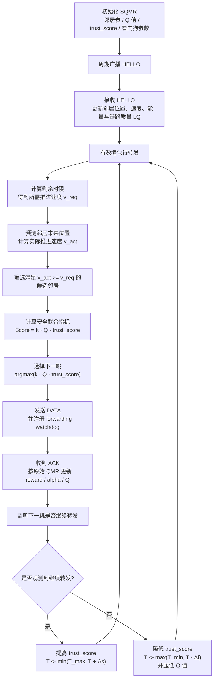

# SQMR 简洁版流程图

## 图注建议

图 X 展示了 SQMR 协议的整体流程。与原始 QMR 相比，SQMR 在保留邻居发现、候选筛选、Q-learning 更新等基本结构的同时，新增了面向下一跳真实转发行为的看门狗观测与信任更新机制。节点在完成一次数据发送后，不仅依据 ACK 反馈更新 Q 值，还进一步监听下一跳是否继续转发该数据包，并据此动态调整该邻居的信任值，从而实现对黑洞和灰洞攻击的抑制。
